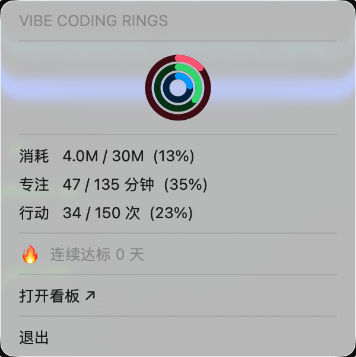
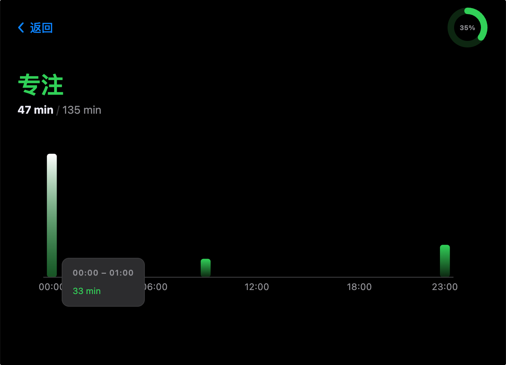

# Vibe Coding Rings

A local macOS dashboard that visualises your [Claude Code](https://claude.ai/code) usage as three animated concentric rings — inspired by Apple Activity Rings. All data is read passively from `~/.claude/` with no external services or API keys required.


<p align="center">
  
  &nbsp;&nbsp;
  
</p>

## Three rings

| Ring | Metric | Colour |
|------|--------|--------|
| ⚡ 消耗 / Consume | Tokens consumed today | Red |
| ⏱ 专注 / Focus | Active AI session minutes today | Green |
| ⚙️ 行动 / Action | Tool calls executed today | Blue |

## Features

- Animated ring dashboard with daily progress toward configurable goals
- 7-day history bar chart
- Hourly drill-down for each metric (click any ring stat row)
- macOS menubar app — glanceable stats without opening the browser
- Bilingual UI — switch between 中文 and English at any time
- Zero config: reads `~/.claude/` directly, no API keys, no telemetry

## Requirements

- macOS (menubar mode requires macOS; web dashboard works anywhere Python runs)
- Python 3.9+
- Claude Code installed and in use (data lives in `~/.claude/`)

## Installation

```bash
git clone https://github.com/zxw1992/vibe-coding-rings.git
cd vibe-coding-rings
pip install -r requirements.txt
```

## Usage

**Web dashboard** — opens automatically at `http://localhost:8765`
```bash
python main.py
```

**macOS menubar app** — shows live stats in the system tray and serves the web UI
```bash
python menubar.py
```

**Sanity check** — print today's metrics and 7-day history to stdout
```bash
python data_collector.py
```

## Configuring goals

Default goals: **1 M tokens / 120 min focus / 50 tool calls** per day.

Adjust them via the "每日目标 / Daily Goals" panel in the web UI — drag the sliders or type a value, and changes persist immediately (saved to `config.json`). The menubar updates in real time without a restart.

## Project structure

```
config.py          Goals dataclass + load/save config.json
data_collector.py  All ~/.claude/ parsing — no server imports
main.py            FastAPI server + browser auto-launch
menubar.py         rumps menubar app; starts FastAPI in a daemon thread
static/
  index.html       Single-page app (main dashboard + detail overlay)
  style.css        Dark theme, Apple Fitness colour palette
  rings.js         All frontend logic: rings, charts, goals, language
```

## How data is collected

Two sources, both local and read-only:

- **`~/.claude/projects/**/*.jsonl`** — one file per conversation. Each assistant entry contains token usage and tool-call blocks. Filtered to today's local date using a UTC timestamp range conversion.
- **`~/.claude/history.jsonl`** — one entry per user message with a session ID and epoch-ms timestamp. Used to compute *focus time*: messages are grouped by session; consecutive pairs with a gap > 30 min start a new focus block, and each block gets +5 min trail credit.

No data ever leaves your machine.

## Dependencies

```
fastapi>=0.100
uvicorn>=0.20
rumps>=0.4.0    # macOS menubar only
```

`rumps` depends on `pyobjc` and is macOS-only. For cross-platform tray support, replace `menubar.py` with [`pystray`](https://github.com/moses-palmer/pystray) using the same FastAPI server-thread pattern.

## License

MIT
