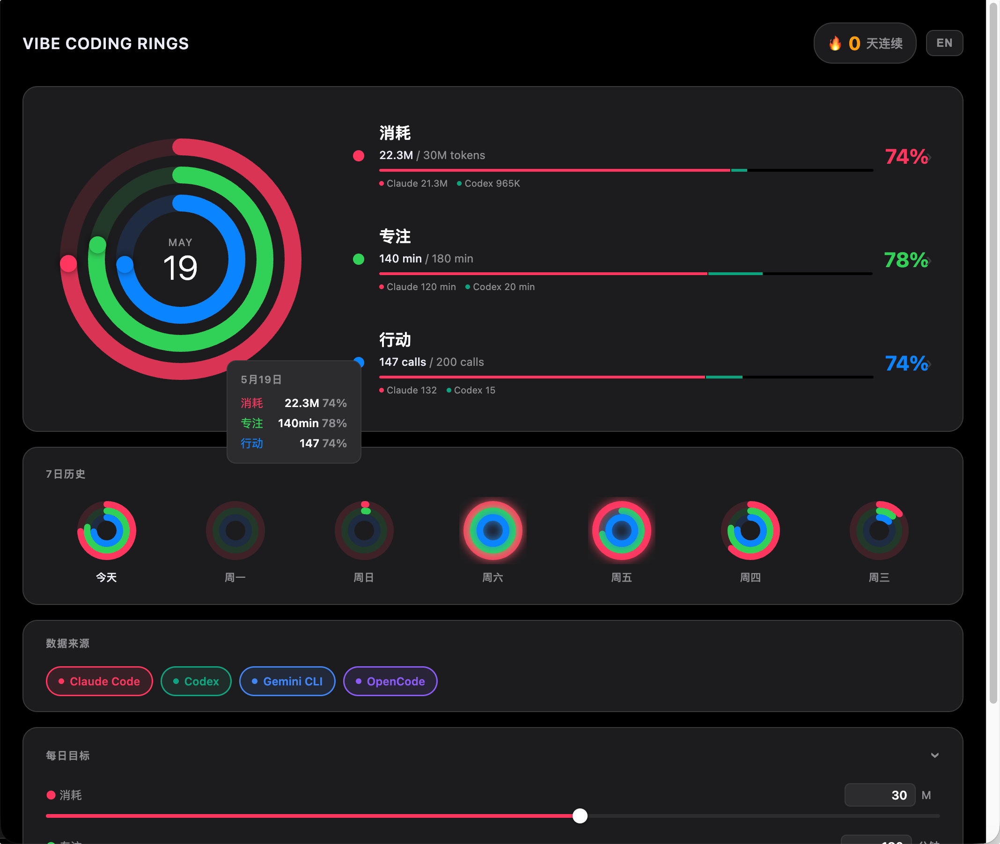
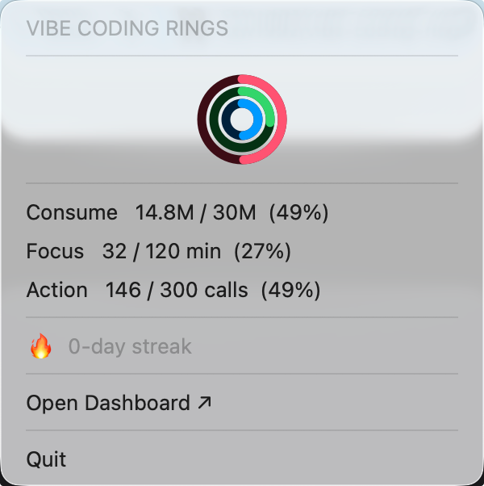
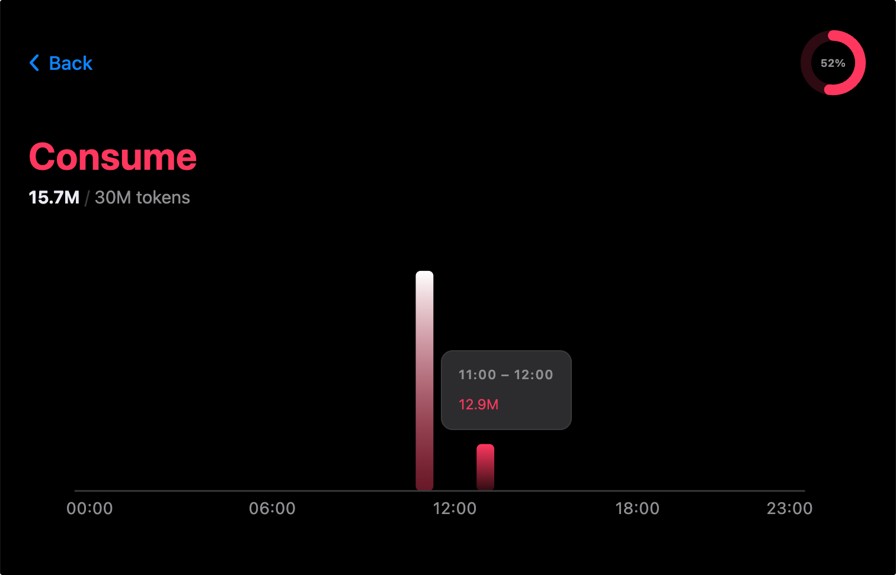

# Vibe Coding Rings

[中文文档](README_zh.md)

A local dashboard that visualises your AI coding agent usage as three animated concentric rings — inspired by Apple Activity Rings. Supports **Claude Code**, **Codex CLI**, **Gemini CLI**, and **OpenCode**. All data is read passively from local files with no external services or API keys required.



<p align="center">
  
  &nbsp;&nbsp;
  
</p>

## Three rings

| Ring | Metric | Colour |
|------|--------|--------|
| ⚡ 消耗 / Consume | Tokens consumed today | Red |
| ⏱ 专注 / Focus | Active AI session minutes today | Green |
| ⚙️ 行动 / Action | Tool calls executed today | Blue |

## Features

- Animated ring dashboard with daily progress toward configurable goals
- **Multi-agent support** — toggle which AI coding tools contribute data (Claude Code, Codex CLI, Gemini CLI, OpenCode)
- 7-day history with mini rings — click any day to see all three metrics with hourly breakdowns
- Hourly drill-down for each metric (click any ring stat row for today's data)
- macOS menubar app — glanceable stats without opening the browser
- Bilingual UI — switch between 中文 and English at any time
- Zero config: reads local agent data directly, no API keys, no telemetry

## Requirements

- Python 3.9+
- At least one supported AI coding agent: Claude Code (`~/.claude/`), Codex CLI (`~/.codex/`), Gemini CLI (`~/.gemini/`), or OpenCode (`~/.opencode/`)
- macOS / Windows / Linux

## Installation

```bash
git clone https://github.com/zxw1992/vibe-coding-rings.git
cd vibe-coding-rings
pip install -r requirements.txt
```

## Usage

**Web dashboard** — opens automatically at `http://localhost:8765`
```bash
python main.py
```

**System tray app** — shows live stats in the menubar/tray and serves the web UI (macOS, Windows, Linux)
```bash
python menubar.py
```

**Sanity check** — print today's metrics and 7-day history to stdout
```bash
python data_collector.py
```

## Configuring goals

Default goals: **1 M tokens / 120 min focus / 50 tool calls** per day.

Adjust them via the "每日目标 / Daily Goals" panel in the web UI — drag the sliders or type a value, and changes persist immediately (saved to `config.json`). The menubar updates in real time without a restart.

## Project structure

```
config.py              Goals dataclass + load/save config.json
agent_providers.py     AgentProvider ABC + per-agent implementations
data_collector.py      Aggregates metrics across active providers
main.py                FastAPI server + browser auto-launch
menubar.py             System tray app (rumps on macOS, pystray on Windows/Linux)
static/
  index.html           Single-page app (main dashboard + detail overlays)
  style.css            Dark theme, Apple Fitness colour palette
  rings.js             All frontend logic: rings, charts, goals, agent chips, language
```

## How data is collected

Each agent provider reads its own local files — all read-only, nothing leaves your machine:

| Agent | Session files | Focus source |
|-------|--------------|-------------|
| Claude Code | `~/.claude/projects/**/*.jsonl` | `~/.claude/history.jsonl` |
| Codex CLI | `~/.codex/**/*.jsonl` | `~/.codex/history.jsonl` |
| Gemini CLI | `~/.gemini/**/*.jsonl` | `~/.gemini/history.jsonl` |
| OpenCode | `~/.opencode/**/*.jsonl` | `~/.opencode/history.jsonl` |

Metrics from all enabled agents are summed. Agents whose data directory doesn't exist are shown as unavailable in the UI. You can toggle any agent on or off from the "Data Sources" chip bar.

## Dependencies

```
fastapi>=0.100
uvicorn>=0.20
rumps>=0.4.0      # macOS only — installed automatically on macOS
pystray>=0.19     # Windows/Linux only
pillow>=9.0       # Windows/Linux only (tray icon rendering)
```

`menubar.py` detects the platform at runtime and uses `rumps` (native macOS menubar) or `pystray` (Windows/Linux system tray) automatically.

## License

MIT
